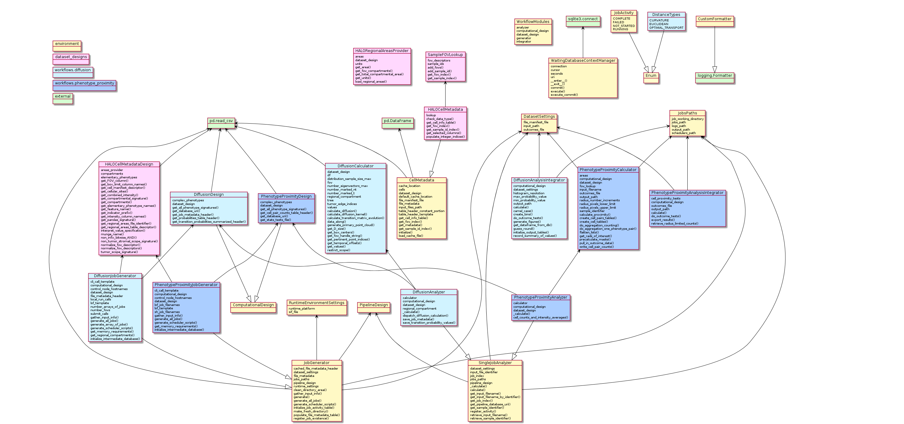
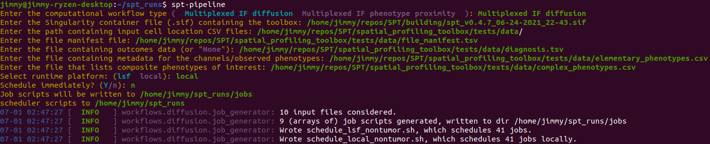
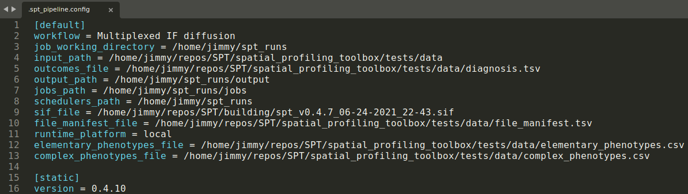
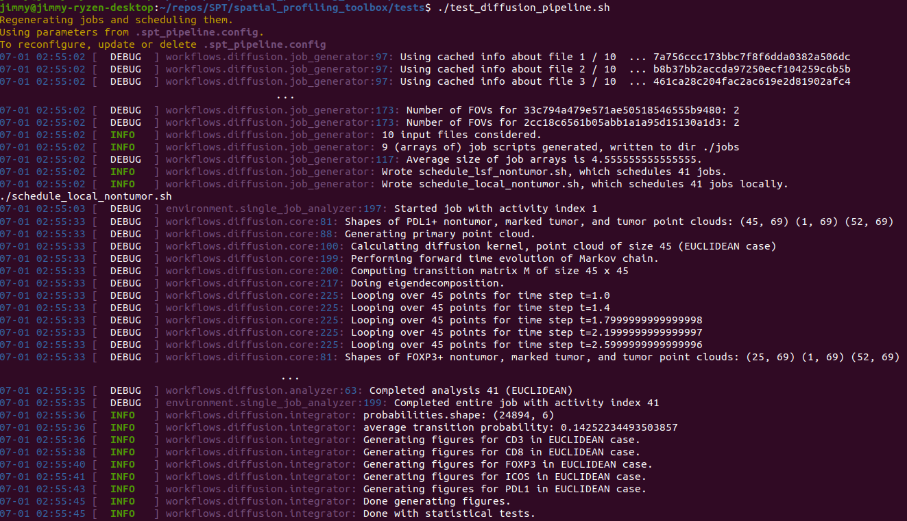
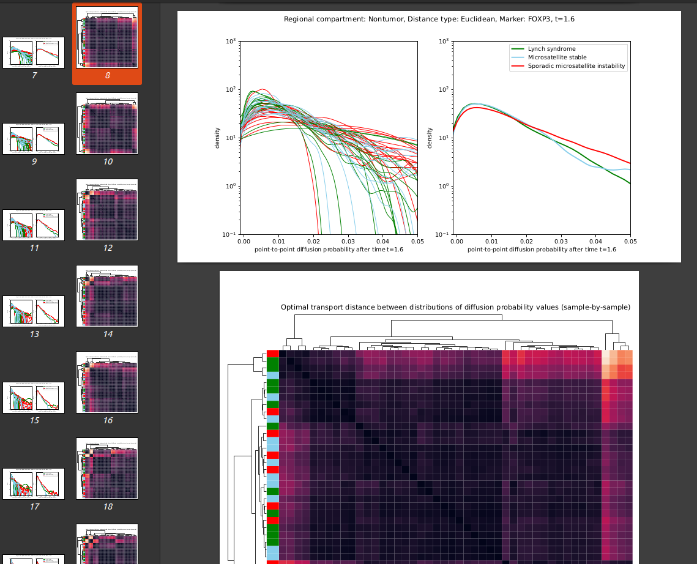
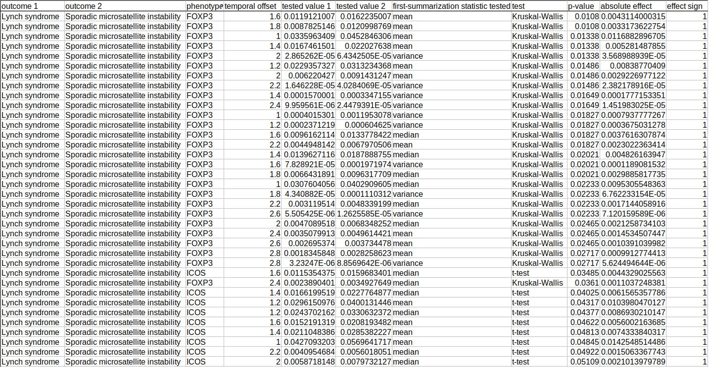

# Spatial Profiling Toolbox

The Spatial Profiling Toolbox (SPT) concerns histopathology image analysis workflows.

It is a young project (~ 2 months), currently consisting of a handful of pipelines, none of which start from completely raw image data yet.

## 1. Goals

### *End to end* automatic pipelines.

From data to computation to tables and figures. *Sacrificing analytic sophistication if necessary!*

A primary purpose of this is to reduce the marginal cost of running on new data, and the cost of independent reproduction.

### Directly support deployment in HPC or cloud

Publication-associated supporting code tends to be unprepared to run on institutional computing resources. Preparing it for use on real (large) datasets is a monotonous, error-prone procedure that ought not be repeated anew for every new dataset.

### Software development discipline

To allow future collaborators/maintainers to keep their sanity and keep the codebase lean and strong:

1. [Version control](https://github.com/nadeemlab/SPT) and release management.
2. Granular [feature planning and bugfix tickets](https://github.com/nadeemlab/SPT/issues).
2. Continuous integration.
3. Aggressive modularity.
4. Quarantined dependence on third-party libraries.
5. Quarantined dependence on particular datasets.
6. Unit testing.
7. Concise, future-proof [developer-facing documentation](_build/html/spatial_profiling_toolbox.html).

### A few core workflows

Focus on enabling workflows that showcase and advance the research of the [Nadeem](https://nadeemlab.org/) and Hollman labs:

1. *Density/counts/areas metrics*.
2. *Cell type proximity analysis*.
3. *Phenotype combination inference*.
4. *Diffusion/Markov arrangement geometry characterization*.
5. *Tensor Fourier/Schur spectral analysis of multiple-phenotype arrangements*.
6. *Network statistics (centralities, Optimal Transport, discrete curvature)*.

## 2. Design

The currently-implemented workflows are based on original scripts written by Rami Vanguri. SPT is a Python package, with subpackages:

1. `environment`. An area for utility functions and interfaces to advertise intended functionality in a manner that is agnostic to dataset particulars, deployment particulars, etc.
2. `dataset_designs`. The logic that parses incoming data and metadata and (ideally) makes it entirely available as in-memory data structures optimized for subsequent computation.
3. `workflows`. The implementation classes specific to a single end-to-end workflow. Divided into job generation, single-task computation, and integration/aggregation for statistical analysis and figures.
4. `scripts`. The entry points into the library that are exposed to the system environment.

A [fully documented schema](https://github.com/nadeemlab/SPT/blob/main/schemas/file_manifest_specification_v0.5.md) for a file asset manifest helps the dataset design modules with low-level tasks like verifying the byte integrity of input files. It requires the user to conform to the schema when preparing metadata for the input data bundle.

The library's class diagram is shown below.

## 3. Deployment

A minimal (yet complete) framework is in place to deploy each pipeline on a High-Performance Computing cluster running on Platform LSF.

Although the pipeline is fully configurable by means of a configuration file, a CLI dialog serves as *de facto* "self-documentation":

Here is how the logs look during a test run:

## 4. Inspecting the results

Here are figures generated by a recent real deployment of the diffusion analysis workflow, as shown in a PDF reader:

And an excerpt from a table showing binary outcome comparison statistical test results:

## 5. Missing parts

1. A segmentation module to reduce the manual labor of HALO-style image processing (e.g. "ImPartial"). This will of course be on-going, since segmentation famously still requires a lot of babysitting.
2. Delegation of job deployment to a modern workflow engine. Migration to [Nextflow](https://www.nextflow.io/) is planned.
3. Interactive inspection of results (e.g. interactive figure tweaking).
4. Proper continuous integration.
5. Proper unit testing.
6. Rami and I hope to convince a [collaborator](https://bmi.stonybrookmedicine.edu/people/chao_chen) at Stony Brook to contribute a *persistent homology* module.
7. Certain other, basic workflows. We are soliciting suggestions for additions (standalone or add-ons) that would be useful to others!
